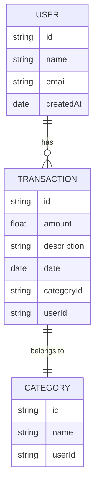

## Índice

0. [Ficha del proyecto](#0-ficha-del-proyecto)
1. [Descripción general del producto](#1-descripción-general-del-producto)
2. [Arquitectura del sistema](#2-arquitectura-del-sistema)
3. [Modelo de datos](#3-modelo-de-datos)
4. [Especificación de la API](#4-especificación-de-la-api)
5. [Historias de usuario](#5-historias-de-usuario)
6. [Tickets de trabajo](#6-tickets-de-trabajo)
7. [Pull requests](#7-pull-requests)

---

## 0. Ficha del proyecto

### **0.1. Tu nombre completo:**
Antonio Vara Piquer

### **0.2. Nombre del proyecto:**
whereismymoney

### **0.3. Descripción breve del proyecto:**
> Aplicación web para llevar un control de tus gastos y ingresos.

### **0.4. URL del proyecto:**
>Frontend: https://subtle-sable-83e760.netlify.app/
>Backend: https://whereismymoney.onrender.com


### 0.5. URL o archivo comprimido del repositorio

> Puedes tenerlo alojado en público o en privado, en cuyo caso deberás compartir los accesos de manera segura. Puedes enviarlos a [alvaro@lidr.co](mailto:alvaro@lidr.co) usando algún servicio como [onetimesecret](https://onetimesecret.com/). También puedes compartir por correo un archivo zip con el contenido


# WhereIsMyMoney - Documentación del Proyecto

## 1. Descripción general del producto

### **1.1. Objetivo:**
El propósito principal de WhereIsMyMoney es permitir a los usuarios gestionar sus finanzas personales de forma eficiente. La aplicación proporciona una experiencia visual clara mediante gráficos e informes interactivos, facilitando el seguimiento de ingresos y gastos. Esto empodera a los usuarios para tomar decisiones financieras informadas y alcanzar sus metas económicas.

### **1.2. Características y funcionalidades principales:**
1. **Registro de transacciones:** Permite registrar ingresos y gastos con detalles como fecha, monto, descripción y categoría.
2. **Categorización:** Los usuarios pueden organizar sus transacciones en categorías personalizadas.
3. **Visualización gráfica:** Informes dinámicos y gráficos que muestran tendencias de gastos e ingresos.
4. **División de gastos:** Posibilidad de fraccionar gastos con otras personas y realizar un seguimiento.
5. **Exportación de datos:** Informes financieros exportables en formatos comunes como PDF o Excel.
6. **Autenticación segura:** Acceso mediante Google Auth para mayor seguridad y facilidad de uso.

### **1.3. Diseño y experiencia de usuario:**
- **Estética:** Diseño limpio, profesional y moderno, inspirado en la interfaz de Airbnb.
- **Usabilidad:** Flujo intuitivo para registrar y visualizar transacciones.
- **Accesibilidad:** Compatible con dispositivos móviles y navegadores modernos.

### **1.4. Instrucciones de instalación:**
1. **Requisitos previos:**
   - Node.js v16+
   - MongoDB v5+
   - Cuenta de Google para autenticación.

2. **Pasos de instalación:**
   - Clonar el repositorio desde [GitHub](https://github.com/avarap/whereismymoney).
   - Configurar las variables de entorno en un archivo `.env` (ver ejemplo en `.env.example`).
   - Instalar dependencias ejecutando `npm install` en las carpetas `/client` y `/server`.
   - Ejecutar el proyecto:
     ```bash
     # Backend
     cd server
     npm start
     # Frontend
     cd client
     npm start
     ```

---

## 2. Arquitectura del Sistema

### **2.1. Diagrama de arquitectura:**
```
[Usuario] <--> [Frontend (React)]
            <--> [Backend (Node.js + Express)]
            <--> [Base de Datos (MongoDB)]
```

### **2.2. Descripción de componentes principales:**
1. **Frontend (React):**
   - Implementa la interfaz de usuario con componentes reutilizables.
   - Comunicación con la API backend mediante Axios.

2. **Backend (Node.js + Express):**
   - API REST para gestionar las operaciones de usuarios y transacciones.
   - Validación de datos mediante `express-validator`.

3. **Base de Datos (MongoDB):**
   - Almacena datos estructurados, incluyendo usuarios, transacciones y categorías.

### **2.3. Descripción de alto nivel del proyecto y estructura de ficheros:**
```
/client
  /src
    /components
    /pages
    /services
  package.json
/server
  /models
  /routes
  /controllers
  package.json
/tests
.env
README.md
```

### **2.4. Infraestructura y despliegue:**
- **Frontend:** Deploy en Netlify para alta disponibilidad.
- **Backend:** Deploy en Render con balanceo de carga.
- **Base de datos:** MongoDB Atlas para un almacenamiento escalable y seguro.

### **2.5. Seguridad:**
- **Cifrado de datos:** Uso de HTTPS para comunicaciones seguras.
- **Protección de datos sensibles:** Contraseñas cifradas con bcrypt.
- **Políticas de seguridad:** Implementación de CORS para limitar el acceso.

### **2.6. Tests:**
- **Framework:** Jest para pruebas unitarias y de integración.
- **Estrategia de pruebas:**
  - Pruebas unitarias: Validar lógica interna del backend y frontend.
  - Pruebas de integración: Verificar la interacción entre API y base de datos.

---

## 3. Modelo de Datos

### **3.1. Diagrama del modelo de datos:**


### **3.2. Descripción de entidades principales:**
- **Usuario:** Contiene información básica del usuario.
- **Transacción:** Representa los detalles de ingresos y gastos.
- **Categoría:** Clasifica las transacciones.

---

## 4. Especificación de la API

### **Endpoints principales:**
1. **GET /transactions**
   - Lista las transacciones de un usuario.
2. **POST /transactions**
   - Registra una nueva transacción.
3. **PUT /transactions/:id**
   - Actualiza los datos de una transacción específica.
4. **DELETE /transactions/:id**
   - Elimina una transacción.

---

## 5. Historias de Usuario

### **Historia 1: Registrar nuevos ingresos y gastos**
**Como** usuario, **quiero** registrar mis ingresos y gastos **para** mantener un control financiero.

### **Historia 2: Categorizar ingresos y gastos**
**Como** usuario, **quiero** clasificar mis transacciones por categoría **para** entender mis patrones de gasto.

### **Historia 3: Exportar informes**
**Como** usuario, **quiero** exportar informes financieros **para** revisarlos fuera de la aplicación.

---

## 6. Tickets de Trabajo

### **Backend: Crear API para registrar transacciones**
**Tarea:** Crear la ruta POST `/transactions`.
1. Definir el modelo en MongoDB.
2. Implementar validaciones de datos.
3. Probar la funcionalidad con Jest.

### **Frontend: Crear formulario para registrar ingresos/gastos**
**Tarea:** Crear un formulario React con validaciones de campos.

### **Base de Datos: Modelo de transacciones**
**Tarea:** Crear un esquema para las transacciones.

---

## 7. Pull Requests

### **PR 1:** Implementación del modelo de datos
- Adición del modelo de usuario, transacción y categoría.

### **PR 2:** Desarrollo del backend
- Creación de rutas básicas para transacciones.

### **PR 3:** Diseño del frontend
- Interfaz de usuario funcional para gestionar transacciones.
